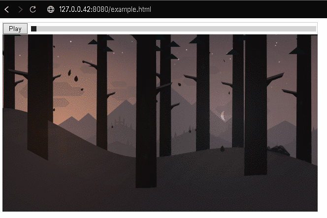

# GifPlayerJS



GifPlayerJS is a lightweight JavaScript utility that converts standard `` elements pointing to `.gif` files into interactive, frame-by-frame GIF players with play/pause controls and a timeline slider. It leverages [libgif.js](https://github.com/kelyvin/libgif-js) under the hood to give you control over each GIF’s frames.

---

## Features

- **Play/Pause**: Easily toggle GIF playback.  
- **Timeline Slider**: Scrub through frames to see specific parts of the GIF.  
- **Auto-Initialization**: Automatically finds all `` elements whose `src` attribute ends in `.gif` (case-insensitive).  
- **No External Dependencies**: Other than [libgif.js](https://github.com/kelyvin/libgif-js), you just need this single script to enable interactive GIF controls on your page.  
- **Lightweight**: Straightforward and minimal code—perfect for small projects or demos.

## For the future:

- [ ] Implement proper CSS for styling of the playback controls
- [ ] Implement a proper Player class that encapsulates everything in a single div

---

## Getting Started

### 1. Include libgif.js and GifPlayerJS
In your HTML, make sure you include [libgif.js](https://www.jsdelivr.com/package/npm/libgif) **before** `gifplayer.js`:

```html
<script src="https://cdn.jsdelivr.net/npm/libgif@0.0.3/libgif.js"></script>
<script src="gifplayer.js"></script>
<!-- Or also using https://raw.githack.com-->
<script src="https://raw.githack.com/hasielhassan/GifPlayerJS/v0.0.2/gifplayer.js"></script>

```

### 2. Initialize
After the page has loaded, call InitializeGifPlayers() to convert all .gif images into interactive players:


```html
<script>
  window.addEventListener('load', InitializeGifPlayers);
</script>
```

### Example
Here’s a minimal working example (`example.html`):

```html
<!DOCTYPE html>
<html lang="en">
<head>
  <meta charset="UTF-8" />
  <title>GifPlayerJS Example</title>
  <!-- libgif -->
  <script src="https://cdn.jsdelivr.net/npm/libgif@0.0.3/libgif.js"></script>
  <!-- GifPlayerJS -->
  <script src="gifplayer.js"></script>
  <!-- Or also using https://raw.githack.com-->
  <script src="https://raw.githack.com/hasielhassan/GifPlayerJS/v0.0.2/gifplayer.js"></script>
</head>
<body>
  <!-- Some .gif images -->
  
  <!-- one with custom smaller image resolution -->
  
  <script>
    // On load, initialize
    window.addEventListener('load', InitializeGifPlayers);
  </script>
</body>
</html>
```

### Technical notes

Since this project uses libgif, it also inheriths the `same-domain origin` restriction and must be loaded via a webserver, not directly from disk.

For more info reference the original notes on libgif: [caveat-same-domain-origin](https://github.com/kelyvin/libgif-js/?tab=readme-ov-file#caveat-same-domain-origin)